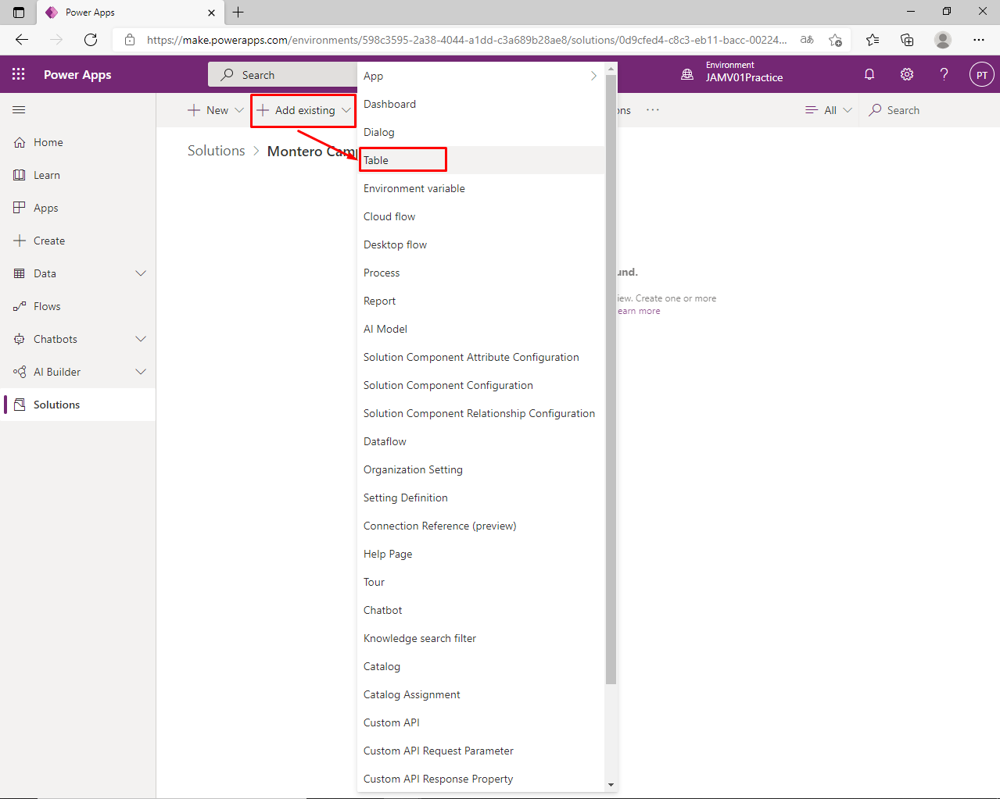
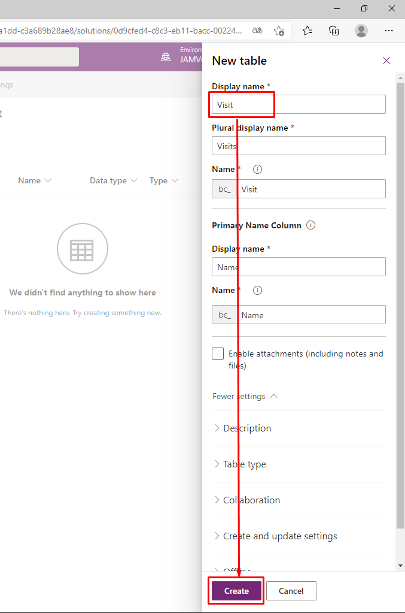
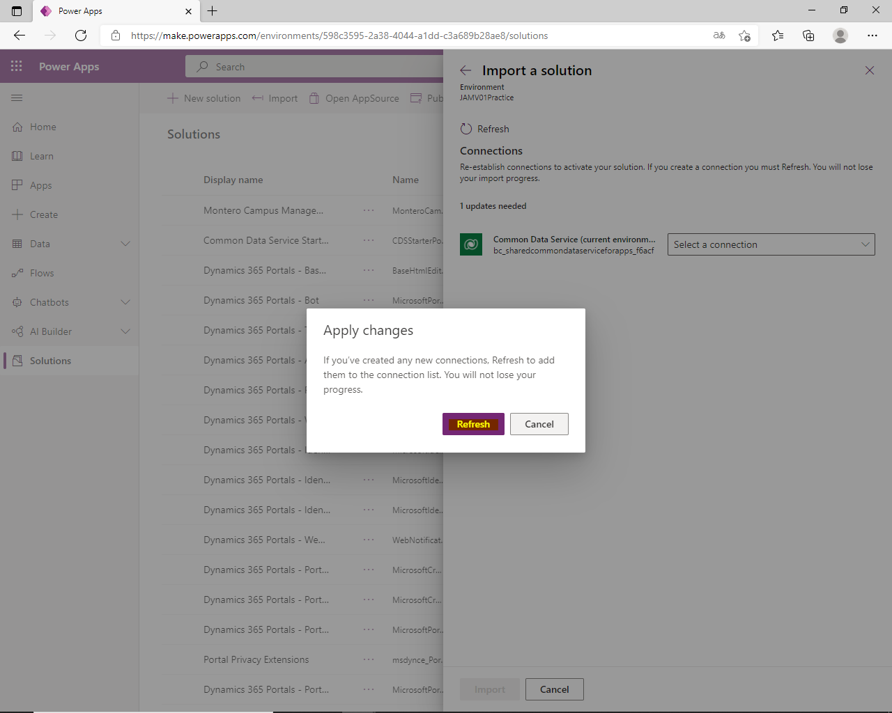

# Module 0: Course introduction

## Exercise 1 – Setup

### Task 1 - Acquire your Power Platform trial tenant

### Task #2 – Create environment

# Exercise #2: Provision a Power Apps portal

## Task #1: Create Power Apps portal

# Module 2: Introduction to Microsoft Dataverse

# Exercise #1: Create Solution

## Task #1: Create Solution and Publisher

# Exercise #2: Add Existing and Create New Tables

## Task #1: Add Existing Table

## Task #2: Create Building Table

## Task #3: Create Visit Table and Columns

# Exercise #3: Create Relationships

## Task #1: Create Relationships

# Exercise #4: Import Data

## Task #1: Import solution

